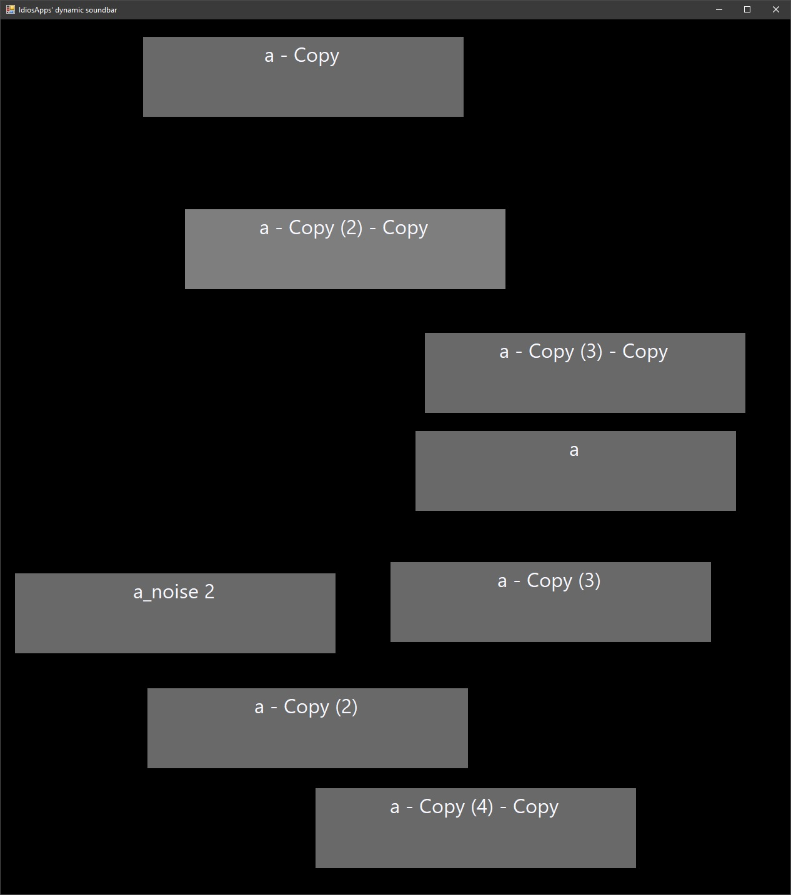
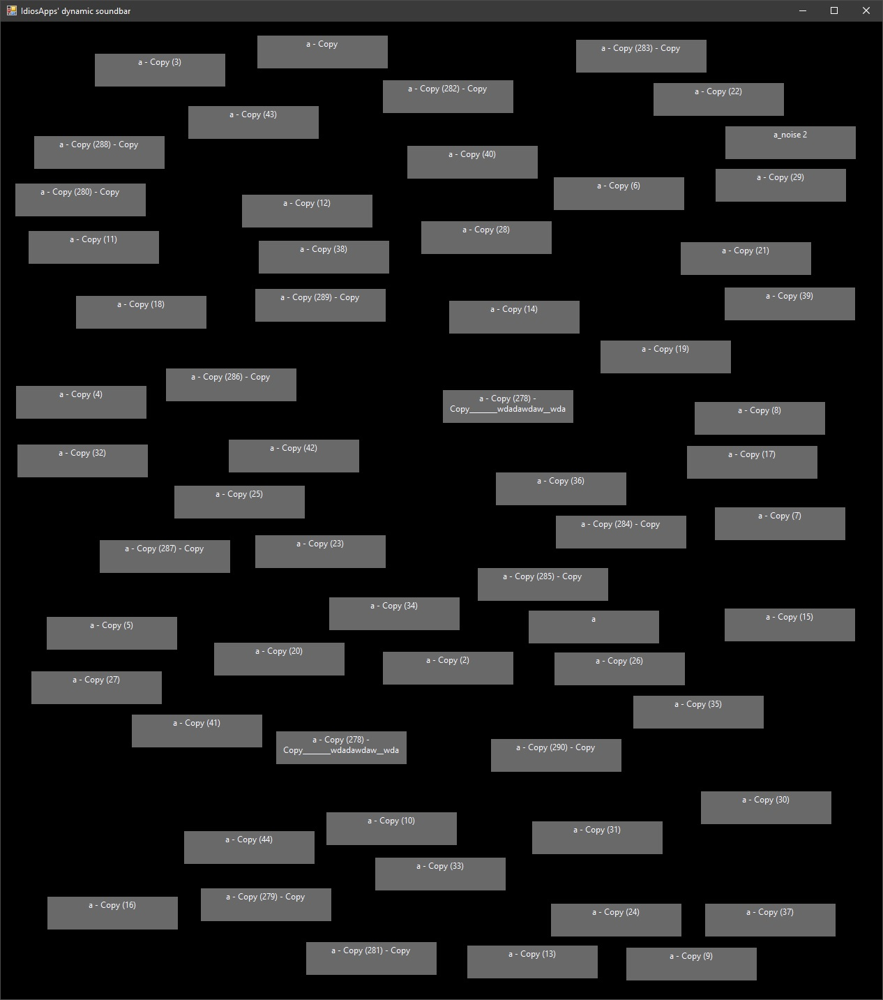
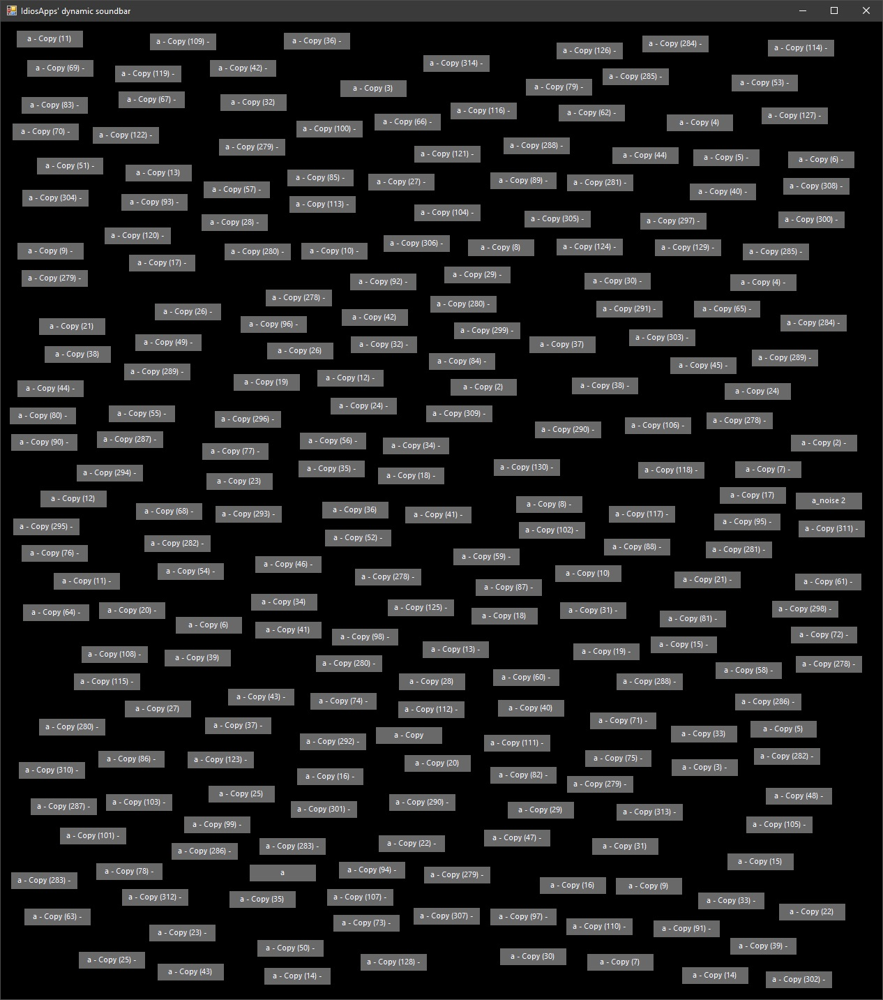

# soundboard
## Super simple dynamically-generated soundboard

Place audio files in directory of .exe.

Please create an issue if there is an audio type that isn't playing for you, or if you have any other issues.

For 8 files:
 

For 60 files:
 

For 200+ files:
 
